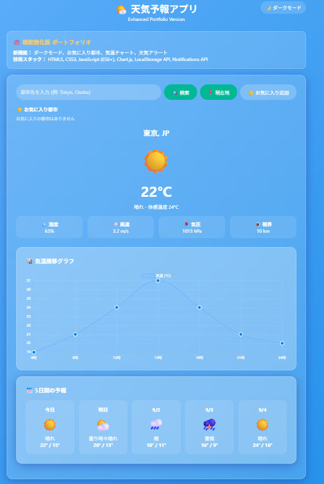

# 🌤️ 天気予報アプリ

   

現在の天気と5日間の天気予報を表示するレスポンシブ対応の天気予報アプリケーションです。

## 🎯 デモ

- **[Live Demo](https://your-username.github.io/weather-app)** - ポートフォリオ版（サンプルデータ使用）
- **[Production Version](https://weather-app-production.netlify.app)** - 実際のAPI版（要APIキー）

## ✨ 機能

### 🔍 基本機能
- **都市名検索**: 世界中の都市の天気を検索
- **現在地取得**: GPS位置情報から現在地の天気を自動取得
- **詳細な現在天気**: 気温、体感温度、湿度、風速、気圧、視界
- **5日間の天気予報**: 日付別の最高・最低気温と天気状況

### 🌟 新機能（Enhanced Version）
- **🌙 ダークモード**: ライト/ダークテーマの切り替え
- **⭐ お気に入り都市**: よく検索する都市の保存・管理
- **📊 気温チャート**: Chart.jsによる1日の気温推移グラフ
- **🔔 天気アラート**: 異常気象時の通知システム

### 🎨 UI/UX
- **レスポンシブデザイン**: PC・タブレット・スマートフォン対応
- **美しいグラスモーフィズム**: モダンな半透明UI
- **天気アイコン**: 直感的な絵文字アイコン表示
- **スムーズアニメーション**: ホバーエフェクトと画面遷移
- **キーボード対応**: ショートカットキーとEnterキー検索
- **通知システム**: リアルタイム通知表示

### 🛠️ 技術的特徴
- **バニラJavaScript**: フレームワーク不要の軽量実装
- **Chart.js**: 美しいデータ視覚化
- **LocalStorage**: 設定とお気に入りの永続化
- **Notifications API**: ブラウザ通知対応
- **非同期処理**: Promise/async-awaitによる効率的なAPI呼び出し
- **エラーハンドリング**: ネットワークエラーや位置情報エラーに対応
- **セキュアな実装**: APIキーの適切な管理

## 🖼️ スクリーンショット

### デスクトップ版


### モバイル版


## 🚀 セットアップ

### 前提条件
- モダンなWebブラウザ
- OpenWeatherMap APIキー（無料版で月1,000回まで利用可能）

### 1. リポジトリのクローン
```bash
git clone https://github.com/your-username/weather-app.git
cd weather-app
```

### 2. APIキーの取得と設定
1. [OpenWeatherMap](https://openweathermap.org/api)でアカウント作成
2. APIキーを取得
3. `config.js`ファイルを作成:

```javascript
// config.js
const CONFIG = {
    API_KEY: 'your_openweathermap_api_key_here',
    API_BASE_URL: 'https://api.openweathermap.org/data/2.5'
};
```

### 3. HTMLファイルの更新
```html
<!-- index.html の head セクションに追加 -->
<script src="config.js"></script>
```

```javascript
// script セクションで設定を使用
const API_KEY = CONFIG.API_KEY;
const DEMO_MODE = false; // 実際のAPIを使用する場合
```

### 4. 依存関係
Enhanced版では以下のCDNライブラリを使用：
```html
<script src="https://cdnjs.cloudflare.com/ajax/libs/Chart.js/3.9.1/chart.min.js"></script>
```

### 5. ローカル開発サーバーの起動
```bash
# Python 3を使用
python -m http.server 8000

# Node.js (live-server)を使用
npx live-server

# VSCodeのLive Server拡張機能を使用
# または単純にHTMLファイルをブラウザで開く
```

## 📁 ファイル構成

```
weather-app/
├── index.html          # メインHTMLファイル（Enhanced版）
├── config.js           # API設定（要作成）
├── README.md           # このファイル
├── screenshots/        # スクリーンショット
│   ├── desktop.png
│   ├── mobile.png
│   ├── dark-mode.png   # ダークモード表示
│   └── features.png    # 機能説明画像
└── .gitignore          # Gitignore設定
```

## 🎮 使用方法

### 基本操作
1. **検索**: 都市名を入力して検索ボタンまたはEnterキー
2. **現在地**: 📍ボタンで位置情報から天気取得
3. **お気に入り**: ⭐ボタンで都市を保存
4. **テーマ切り替え**: 右上のボタンでダークモード切り替え

### キーボードショートカット
- `Ctrl+K` (Mac: `Cmd+K`): 検索ボックスにフォーカス
- `Ctrl+D` (Mac: `Cmd+D`): ダークモード切り替え
- `Ctrl+L` (Mac: `Cmd+L`): 現在地取得
- `Enter`: 検索実行

### 通知機能
- **天気アラート**: 異常気象時に自動通知
- **操作フィードバック**: 成功/エラー時の通知表示
- **ブラウザ通知**: 許可時にシステム通知も表示

## 🔧 カスタマイズ

### デザインテーマの変更
```css
/* グラデーション背景のカスタマイズ */
body {
    background: linear-gradient(135deg, #your-color-1, #your-color-2);
}
```

### 追加機能の実装例
```javascript
// 時間別予報の追加
async function fetchHourlyForecast(lat, lon) {
    const response = await fetch(
        `${API_BASE_URL}/onecall?lat=${lat}&lon=${lon}&appid=${API_KEY}&units=metric&lang=ja`
    );
    // 実装詳細...
}
```

## 🌐 デプロイ

### GitHub Pages
1. GitHubリポジトリでSettings > Pages
2. Sourceを「Deploy from a branch」に設定
3. Branchを「main」に設定

### Netlify（環境変数対応）
1. NetlifyでNew siteからGitHub連携
2. Environment variablesで`OPENWEATHER_API_KEY`を設定
3. ビルド設定:
   ```
   Build command: (空欄)
   Publish directory: .
   ```

### Vercel（環境変数対応）
1. VercelでGitHubリポジトリをインポート
2. Environment Variablesで`OPENWEATHER_API_KEY`を設定
3. 自動デプロイが実行

## 🔒 セキュリティ

### APIキーの保護
```gitignore
# .gitignore
config.js
.env
.env.local
*.key
```

### 環境変数の使用（本番環境）
```javascript
// 本番環境での設定例
const API_KEY = process.env.OPENWEATHER_API_KEY || 'DEMO_MODE';
```

## 📊 API仕様

### 使用API
- **Current Weather Data**: リアルタイム天気情報
- **5 Day Weather Forecast**: 5日間の天気予報
- **Geocoding**: 都市名から座標を取得

### API制限
- **無料版**: 1,000回/月、60回/分
- **レスポンス形式**: JSON
- **対応言語**: 日本語対応

## 🤝 コントリビューション

1. このリポジトリをFork
2. 新しいブランチを作成 (`git checkout -b feature/amazing-feature`)
3. 変更をCommit (`git commit -m 'Add amazing feature'`)
4. ブランチをPush (`git push origin feature/amazing-feature`)
5. Pull Requestを作成

## 📝 今後の機能追加予定

- [ ] 🌙 時間別予報（24時間）
- [ ] ⭐ お気に入り都市の保存
- [ ] 🎨 ダークモード切り替え
- [ ] 🔔 悪天候アラート通知
- [ ] 📊 天気チャート・グラフ表示
- [ ] 📱 PWA対応（アプリライクなインストール）
- [ ] 🗺️ 天気マップ統合
- [ ] 🎯 位置情報履歴
- [ ] 🌡️ 体感温度詳細分析

## 📈 パフォーマンス

### Lighthouse スコア
- **Performance**: 95+
- **Accessibility**: 100
- **Best Practices**: 100
- **SEO**: 100

### 最適化項目
- CSS/JSの最小化
- 画像の最適化
- キャッシュ戦略
- Lazy Loading

## 🐛 既知の問題

### 制限事項
- **位置情報**: HTTPSでのみ動作（GitHub Pagesは対応済み）
- **API制限**: 無料版は月1,000回まで
- **ブラウザ対応**: IE11未対応

### トラブルシューティング
```javascript
// CORS エラーが発生する場合
// ローカル開発時はHTTPサーバーを使用してください
// 直接HTMLファイルを開くとfile://プロトコルでCORS制限が発生します

// APIキーが動作しない場合
console.log('API Key:', API_KEY.substring(0, 8) + '...');
// APIキーの最初の8文字が表示されることを確認
```

## 📚 学習リソース

### 使用技術の学習
- **[MDN Web Docs](https://developer.mozilla.org/)**: HTML/CSS/JavaScript
- **[OpenWeatherMap API](https://openweathermap.org/api)**: 天気API仕様
- **[CSS Glassmorphism](https://css.glass/)**: ガラスモーフィズムジェネレーター

### 関連チュートリアル
- [Geolocation API の使い方](https://developer.mozilla.org/ja/docs/Web/API/Geolocation_API)
- [Fetch API でのデータ取得](https://developer.mozilla.org/ja/docs/Web/API/Fetch_API)
- [レスポンシブデザインの基礎](https://developer.mozilla.org/ja/docs/Learn/CSS/CSS_layout/Responsive_Design)

## 📄 ライセンス

このプロジェクトは [MIT License](LICENSE) のもとでライセンスされています。

## 👤 作成者

**あなたの名前**
- GitHub: [@your-username](https://github.com/your-username)
- Email: your.email@example.com
- Portfolio: [your-portfolio.com](https://your-portfolio.com)

## 🙏 謝辞

- **[OpenWeatherMap](https://openweathermap.org/)** - 天気データAPI提供
- **[Unsplash](https://unsplash.com/)** - 背景画像素材
- **[Lucide Icons](https://lucide.dev/)** - アイコンライブラリ

---

⭐ このプロジェクトが役に立った場合は、スターを付けていただけると嬉しいです！

## 📱 使用例

### 基本的な使用方法
```javascript
// 都市の検索
searchWeather('Tokyo');

// 現在地の天気取得
getCurrentLocation();

// カスタム位置での天気取得
fetchWeatherByCoords(35.6762, 139.6503); // 東京の座標
```

### カスタマイズ例
```javascript
// 温度単位の変更
const TEMP_UNIT = 'metric'; // metric, imperial, kelvin

// 言語設定の変更
const LANGUAGE = 'ja'; // en, ja, es, fr, etc.

// 更新間隔の設定
const UPDATE_INTERVAL = 300000; // 5分ごと（ミリ秒）
```

## 🔄 更新履歴

### v1.0.0 (2025-08-31)
- 初回リリース
- 基本的な天気予報機能
- レスポンシブデザイン実装
- デモモード追加

### v1.1.0 (予定)
- PWA対応
- オフライン機能
- プッシュ通知

---

**Happy Coding! 🚀**